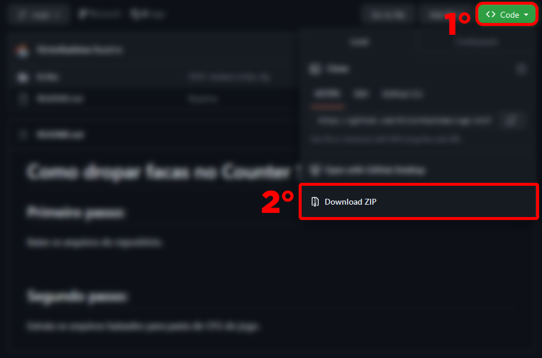
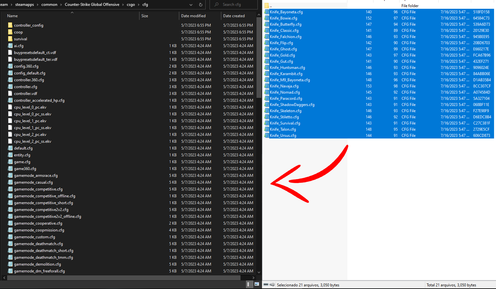

<h1>Como dropar facas no Counter Strike Global Offensive</h1>

<h2><b>Primeiro passo:</b></h2>

Baixe os arquivos do repositório.

 

<h2><b>Segundo passo:</b></h2>

Abra o arquivo zip baixado e extraia os arquivos da pasta "knifes" para pasta de CFG do jogo.

<i>Caminho do diretório de cfg:
 
<u>Steam\steamapps\common\Counter-Strike Global Offensive\csgo\cfg
</u>
</i>

<h2><b>Terceiro passo:</b></h2>
<pre>

Abra o jogo.

Entre em uma partida contra bots.

Abra o console e escreva:
<b><i>exec knife</i></b>

O jogo irá recomendar todos comandos para dropar faca.

Escolha a faca pressionando <b>DOWNARROW</b> e confirme apertando <b>ENTER</b>.
</pre>